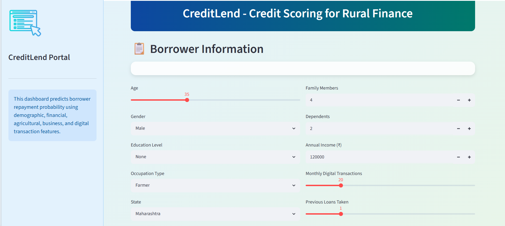
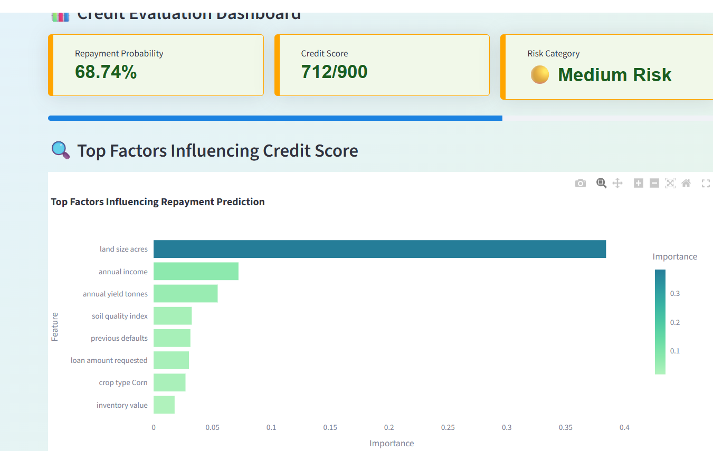
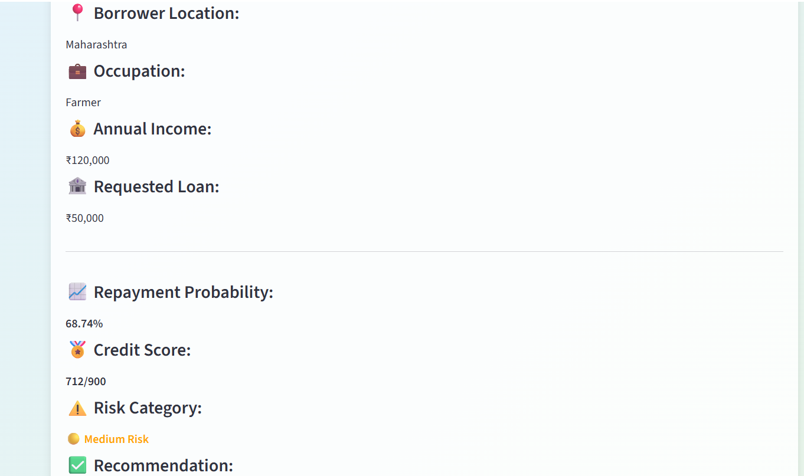

# CreditLend - Digital Credit Scoring System for Rural Finance
## Live Demo

[Click here to view the deployed app]https://digital-credit-scoring-systems-dwqzpi3ofbfpmivfr94tcr.streamlit.app/
CreditLend is a machine learning based digital credit scoring system designed for rural borrowers such as farmers, shopkeepers, dairy workers, daily wage workers, and small business owners.

The project predicts a borrower's loan repayment probability using demographic, financial, agricultural, business, and digital transaction features. The result is displayed through an interactive Streamlit dashboard with repayment probability, credit score, risk category, feature importance, and dataset-level insights.

---

## Problem Statement

In rural finance, many borrowers may not have a strong formal credit history. Traditional credit scoring systems often depend heavily on past banking records, credit cards, and formal loan history. This can make it difficult for rural borrowers to access fair credit evaluation.

This project attempts to build an alternative credit scoring prototype using machine learning. It considers borrower information such as income, occupation, previous defaults, agricultural details, business activity, and digital transaction behavior to estimate repayment probability.

---

## Project Objective

The main objective of this project is to:

* Predict loan repayment probability for rural borrowers
* Generate a credit score between 300 and 900
* Classify borrowers into low, medium, or high risk categories
* Show the top factors influencing the prediction
* Provide a simple and interactive dashboard for credit evaluation

---

## Features Used

The model uses multiple categories of borrower information.

### Demographic Features

* Age
* Gender
* Education level
* State
* Family members
* Dependents

### Financial Features

* Annual income
* Requested loan amount
* Previous loans taken
* Previous default history

### Digital Behavior Features

* Monthly digital transactions

### Agricultural Features

Used when the borrower is a farmer:

* Land size
* Crop type
* Rainfall
* Irrigation type
* Soil quality index
* Annual crop yield

### Business Features

Used for non-farmer borrowers:

* Monthly shop revenue
* Business expenses
* Inventory value

---

## Machine Learning Workflow

The project follows this workflow:

```text
Dataset
   ↓
Data preprocessing
   ↓
Categorical encoding using ColumnTransformer
   ↓
Feature scaling using StandardScaler
   ↓
XGBoost classification model
   ↓
Repayment probability prediction
   ↓
Credit score and risk category generation
   ↓
Streamlit dashboard
```

---

## Model Used

The main prediction model used in this project is:

```text
XGBoost Classifier
```

XGBoost is used because it performs well on structured/tabular datasets and can capture non-linear relationships between borrower features and repayment behavior.

The trained model files are stored inside the `models/` folder:

```text
models/
├── xgb_model.pkl
├── column_transformer.pkl
└── scaler.pkl
```

---

## Dashboard Features

The Streamlit dashboard provides:

* Borrower information input form
* Farmer-specific and non-farmer-specific input sections
* Loan amount input
* Repayment probability prediction
* Credit score generation
* Risk category classification
* Feature importance visualization
* Summary credit report
* State-wise average repayment rate chart

---

## Project Structure

```text
digital-credit-scoring-systems/
│
├── app.py
├── README.md
├── requirements.txt
│
├── data/
│   └── rural_credit_dataset_mixed.csv
│
├── models/
│   ├── xgb_model.pkl
│   ├── column_transformer.pkl
│   └── scaler.pkl
│
├── src/
│   ├── train_model.py
│   └── graphs_paper1.py
│
├── notebooks/
│   └── Untitled.ipynb
│
├── outputs/
│   └── newplot (1).png
│
└── screenshots/
    ├── input_form.png
    ├── credit_report.png
    └── feature_importance.png
```

---

## Screenshots

### Borrower Input Form



### Credit Evaluation Report



### Feature Importance and Dataset Insights



---

## Installation and Setup

### 1. Clone the repository

```bash
git clone https://github.com/KamparaVyshnavi/Digital-credit-scoring-system.git
cd digital-credit-scoring-systems
```

### 2. Install required packages

```bash
python -m pip install -r requirements.txt
```

### 3. Train or regenerate model files

```bash
python src/train_model.py
```

This creates the required model files inside the `models/` folder.

### 4. Run the Streamlit app

```bash
python -m streamlit run app.py
```

Then open the local URL shown in the terminal:

```text
http://localhost:8501
```

---

## Requirements

The project uses the following major Python libraries:

```text
streamlit
pandas
numpy
scikit-learn
xgboost
joblib
plotly
streamlit-extras
```

---

## Output Explanation

The dashboard generates the following results:

### Repayment Probability

The predicted probability that the borrower is likely to repay the loan.

### Credit Score

A score between 300 and 900 generated using the repayment probability.

```text
Credit Score = 300 + Repayment Probability × 600
```

### Risk Category

Borrowers are classified into:

```text
Low Risk
Medium Risk
High Risk
```

### Feature Importance

The dashboard displays the most important factors that influenced the model prediction.

---

## Limitations

This project is an academic prototype and should not be used for real loan approval decisions without proper validation.

Some limitations include:

* The dataset may not represent real-world banking data fully
* The model has not been validated on actual financial institution data
* Credit risk decisions require fairness, explainability, and regulatory checks
* More real-world borrower behavior data would improve reliability

---

## Future Improvements

Possible future improvements include:

* Add SHAP-based explainability
* Improve fairness analysis across gender, state, and occupation
* Add borrower report download as PDF
* Add authentication for bank/admin users
* Deploy the app using Streamlit Cloud
* Use real-world financial datasets for validation
* Add database support for storing borrower evaluations

---

## Conclusion

CreditLend demonstrates how machine learning can be used to build an alternative digital credit scoring system for rural finance. By using demographic, financial, agricultural, business, and digital transaction features, the system provides a prototype for estimating borrower repayment probability and presenting it through an easy-to-use dashboard.
